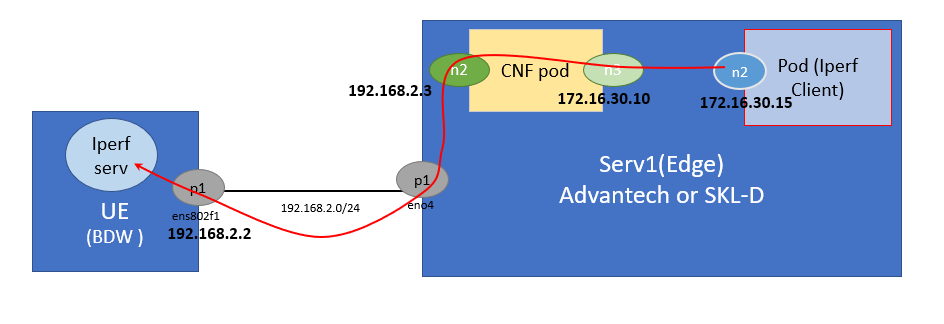

```text
SPDX-License-Identifier: Apache-2.0
Copyright (c) 2020 Intel Corporation
```

<!-- omit in toc -->
# E2E Scenario 2 - One Cluster
Reference architecture E2E network topoloy based SDEWAN

- [Introduction](#introduction)
- [Nework Topology](#network-topology)
- [Deployment](#deloyment)
  - [Configure UE](#configure-ue)
  - [Deploy OpenNESS](#deploy-openness)
  - [Create OVN networks](#create-ovn-networks)
  - [Install SDEWAN](#install-sdewan)
  - [Bring up Iperf-client pod](#bring-up-iperf-client-pod)
- [Iperf Test](#iperf-test)

## Introduction

This is a SDEWAN scenario that demonstrates E2E traffic transfer from Iperf3 running on  a pod deployed on Edge Node to an external UE connected to Node via 10G NIC port. The UE server runs Iperf3 serer. The other serer has single node Openness cluster deployed with sdewan-edge flavor. The Iperf client traffic is expected to pass trough the SDEWAN cnf and attached provider network interface and reach the UE Iperf server.

## Network Topology



## Deployment

### Configure UE

Install Iperf3 package

Configure the interface that is connected to Edge Node Server

  ```
  ifconfig ens802f1 0.0.0.0
  ifconfig ens802f1 down
  ifconfig ens802f1 192.168.2.2/24 up
  ip route add  192.168.2.0/24 via 192.168.2.2 dev <interface>
  ```

### Deploy OpenNESS

Clone Converged Edge Experience Kits from github, and follow this [guide](https://openness.atlassian.net/wiki/spaces/CERA/pages/119177504/OpenNESS+Experience+Kit) to prepare the node.


Deploy OpenNESS:

  ```
  deploy_ne.sh -f sdewan-edge single
  ```

### Create OVN networks

In node_config provide the name of the Node's interface that is connected to UE (provider network interface)

  ```
  source node_config.sh
  ./create_ovn4nfv_networks.sh
  kubectl apply -f ovn4nfv_networks.yml
  
  ```
### Install SDEWAN

Clone edgeapps repository from github.
Install SDEWAN crd-controller


  ```
  cd applications/sdewan_ctrl/chart/
  ```
Adjust sdewan_ctrl/values.yaml file, provide proper image details as below:

  ```
  spec:
  name: "sdewan-controller-manager"
  label: "controller-manager"
  replicas: 1
  proxy:
    # image details must be changed before chart installation
    image:
      registry: ""
      name: "gcr.io/kubebuilder/kube-rbac-proxy"
      tag: "v0.4.1"
    imagePullPolicy: IfNotPresent
    name: "kube-rbac-proxy"
  sdewan:
    # adjust image details before chart installation
    image:
      registry: ""
      name: "integratedcloudnative/sdewan-controller"
      tag: "0.3.0"
    imagePullPolicy: IfNotPresent
    name: "manager"

  ```
Execute ./pre-install.sh script

  ```
  helm install sdewan-ctrl ./sdewan-ctrl

  ```

Go to network-functions/sdewan_cnf
Use the node name to set CNF_NODE in ./pre-install.sh script.
Execute ./pre-install.sh script
Use network configuration as below: (edgeapps/network-functions/sdewan_cnf/chart/sdewan-cnf/values.yaml)

  ```
  nfn:
  - defaultGateway: false
    interface: "net2"
    ipAddress: "192.168.2.3"
    name: "pnetwork"
    separate: ","
  - defaultGateway: false
    interface: "net3"
    ipAddress: "172.16.30.10"
    name: "ovn-network"
    separate: ""
  ```


Confirm sdewan-cnf pod is running, observe the pod’s name:

  ```
  kubectl get pods --all-namespaces | grep  cnf

  
  default         sdewan-cnf-bc6d67d49-p2svh          1/2     Running    0          11h

  ```

Enter the CNF pod and add SNAT rule to cnf to enable connection from UE to Iperf-client pod

  ```
  kubectl exec -it  sdewan-cnf-bc6d67d49-p2svh -- /bin/bash 
  sudo iptables -t nat -A POSTROUTING -s 172.16.30.15 -j SNAT --to-source 192.168.2.3
  ```

### Bring up Iperf client pod

Verify that server_ip and client_ip in iperf_client.sh are set up corectly.

Build iperf-client docker image and build the pod:

  ```
  cd  iperf_files/iperf_img
  docker build -t iperf-client:1.0 .
  cd ..
  ./create_iperf_cli_pod.sh
  kubectl apply -f iperf_cli_pod.yaml
  ```

Configure default gateway on the Iperf-client pod:

  ```
  kubectl exec -it   iperf-client-846f5f69f9-49vdm -- /bin/bash 
  sudo route add default gw 172.16.30.10 net0
  ```
## Iperf Test

Start Iperf server on the UE

  ```
  iperf3 -s  192.168.2.3 -i 60
  ```
Start Iperf client on the pod:

  ```
  kubectl exec -it   iperf-client-846f5f69f9-49vdm -- /bin/bash 
  sudo /iperf_client.sh
  ```

Observe Iperf Server on UE. The output should be similar to:

  ```
  iperf3 -s  192.168.2.2 -i -t60
  -----------------------------------------------------------
  Server listening on 5201
  -----------------------------------------------------------
  Accepted connection from 192.168.2.2, port 59481
  - - - - - - - - - - - - - - - - - - - - - - - - -
  [ ID] Interval           Transfer     Bandwidth
  [  5]   0.00-1606243638.54 sec  0.00 Bytes  0.00 bits/sec                  sender
  [  5]   0.00-1606243638.54 sec  2.23 GBytes  11.9 bits/sec                  receiver
  ```
